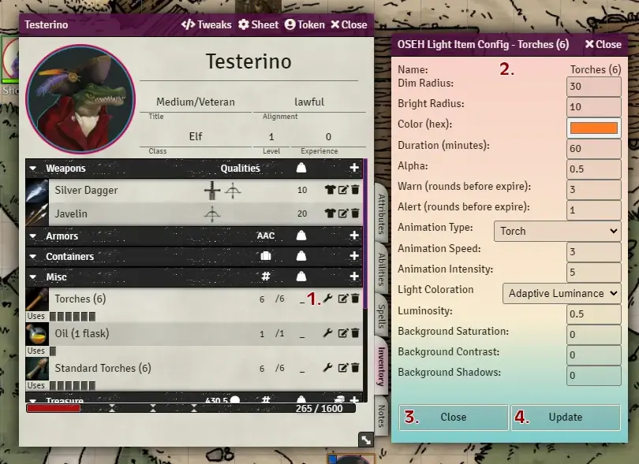
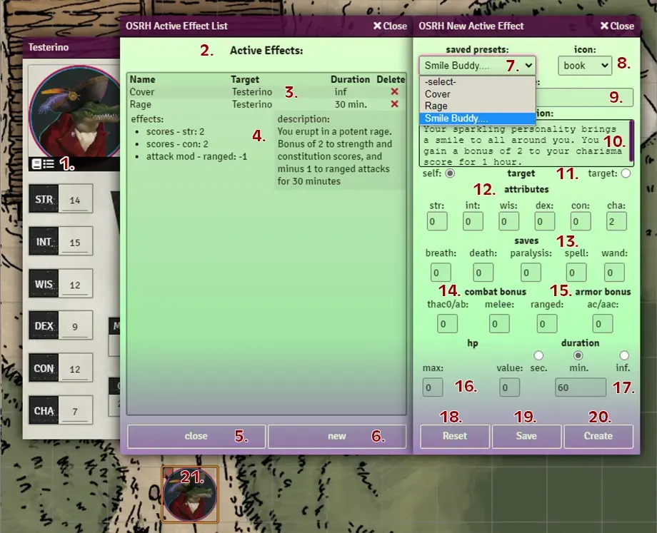
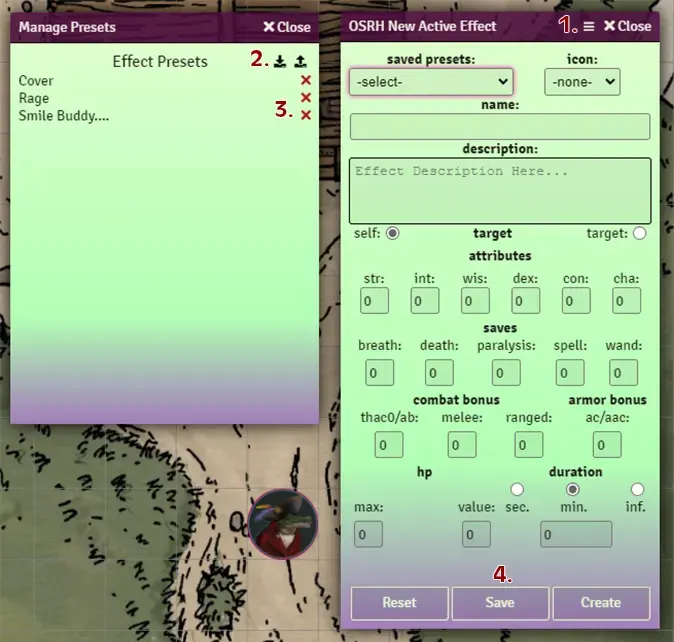

# OSR-helper module

Created by RabidOwlbear.

An unimaginatively named module that aims to assist with light, time, and resource management. For use in games using the Foundry Vtt implementation of the 'Old School Essentials' system.
This module provides several macros found in a compendium named "OSR-helper Macros".

### Important Notice

If updating from the previous version named "OSE-helper", any macros existing in your game worlds from the previous version will no longer function. Please replace them with the included updated versions. We apologize for any inconvenience this causes.

If you have created custom light items in your world you will need to run the provided conversion macro named "Convert Light Data" located in the included macro compendium "Utility Macros" folder. This wil convert your existing light configurations, existing lights  will not function without conversion. this only needs to be run once.

You will also need to disable and/or uninstall the previous "OSE-CharacterBuilder" installation to avoid conflicts.

---

### installation

install using the following manifest url:

https://raw.githubusercontent.com/RabidOwlbear/osr-helper/master/module.json

### usage

Upon initial load a journal entry will be created using the default name of "Turn Count". This journal will be populated with several statistics reflecting number of turns elapsed this session, since that last rest was taken, and the total number of turns so far in the game. Using the provided "OSE-helper Dungeon Turn (base)" macro the Referee can advance the game time in standard 10 minute turn intervals. The "Turn Count" journal will be updated to reflect the current counts.

The provided "OSR-helper reset session count" will reset the session count to zero.
The provided "OSR-helper reset all counts" macro will reset all counts.
The provided "OSR-helper Rest" macro will reset the turns since last rest count to zero.

---

### Using the OSR-helper Dungeon Turn Macro

To set the options for the dungeon turn macro navigate to the OSE helper settings in module settings.
Clicking the dungeon tirn settings button will open a settings window with the following options:

- Encounter Table Name: Enter the name of the encounter table you wish to roll on here, case sensitive.
- Reaction Table Name: Enter the name of the reaction table you wish to roll on here, case sensitive.
- How often to roll for encounter: How often to roll for encounter. Example: if set to 2 a an encounter check would be rolled every 2nd turn.
- Target to roll below to trigger table roll: Target number to roll under to trigger a table roll.
- Roll For Encounters: If checked encounter rolls will be made using the defined options.
- Roll for Reaction: If checked, when an encounter table is rolled, a roll will be made on the provided reaction table.

When used, the Dungeon Turn macro will advance the game time by 10 minutes and update the turn counts by one. It will then check the rest count,. At 3 turns since last rest a chat message will be created warning the players that they need to rest, at +5 turns the worning becomes red. If the players progress beyond 1 hour without rest, the chat message will then include the relevant penalties, repeating this added text every 5 subsequent turns.

The macro will also check to see if random encounter rolls are active, if so itt will check to see if the number of turns since the last roll is greater than the proc interval (see above), if it is, the macro will roll on the provided table, and if set, roll for reaction on the provided table.

---

### Custom Lights

Custom light sources can be created by checking the **Enable Light Item Settings Config.** setting in the ose helper module settings. This setting will add a wrench icon to item display for any item with a "Light" tag applied to it in the characters inventory. (The tag needs to be capitalized in order to function correctly.)

The wrench icon (number 1. in image below) will also be added to the header of the item details window, allowing for lights to be configured from the item sidebar tab, or inside compendiums. 

1. Configuration icon: Click this to open the light item configuration panel.
2. Light Configuration Panel: Here you can define the custom light properties and duration.
3. Close: Closes the configuration panel without saving.
4. Update: Updates the light configuration data.

To activate a light, a player needs access to the provided "Light Toggle " macro. 

To use, a player token must be selected.

When clicked:
- if a light is already lit on the selected token, the light will be extinguished.
- if no light is currently lit, a dialog will be created containing a dropdown populated with the names and quantities of all items in the selected token actors inventory that contain a "Light" tag.
- once a light source is selected, clicking "Light On" with change the selected token's light settings to match tose contained in the selected light source's configuration settings.

note: Several light items have been provided in the OSR-helper Items compendium.
If the macro has been used to light a light source, the light can be extinguished by clicking the macro again, preserving any remaning duration until lit again by clicking the Light On macro and selecting the corresponding light type.

Each time game world time advances, all lit light sources will be checked against their duration, if the duration is exceeded the tight source will be extinguished, and the total quantity for that item will be decremented by 1. If the item quantity is reduced to zero the item will be deleted from the actor's invetory.

---

### Ration Report

The OSR-helper Ration Report macro

When clicked this macro will generate a report detailing all rations currently held by all tracked Player and Retainer actors seprated by name, listing items held and their quantities, color coded.
Total number of days worth of rations for the entire tracked group(assuming the party pools resources) is also profided in a color coded display.

---

### Custom Effects

A 'custom effect' system has been implementd and can be accessed via an  icon located on the character portrait secton of the character sheet when moused over (number 1 in the image below).

#### Active Effects List

1. Active Effects List Icon: Click here to open the Active Effects List panel. This icon will only appear on 'character' type actor sheets.
2. Active Effect List: all current active effects related to this actor will be displayed here.
3. Actor Created Effects: Active Effects created by this actor are displayed here. Each effect will display its name, taget, duration, and a button to delete the effect. Clicking the name of the effect will expand the entry revealing the applied effects and the effect description(if any).
4. Other Created Effects: Active effects created by other actors are displayed here. Each effect will display its name, actor created by, and duration. Each entry can be expanded as above.
5. Close: Closes the panel.
6. New: Opens a New Active Effect panel.

#### New Active Effect

7. Presets: This list will be populated by presets created by the GM. To use a preset simply select one from the list. Its information will then be populated to the fields of the effect form. Click create to apply the effect. Presets can be created by th GM by filling out the active effect form and clicking the save button at the bottom of the form.
8. Icon: an icon for the effect can be selected from thsi dropdown, the name of the icon and its color are displayed.
9. Name (required): Active effect name.
10. Description: active effect description.
11. Target: Selecting 'self' will apply the created active effect to the actor the active effect list was opened from. Selecting target will apply the created active effect to the actor associated with the current targeted single token.
12. Attributes: Changes to abilitiy scores are applied here. The fields accept positive and negative  number values.
13. Saves: Changes to saves are applied here. The fields accept positive and negative number values.
14. Combat Bonus: changes to thac0/attack bonus, melee, and ranged attacks are applied here. This input will assumes a positve number is a bonus, and a negative value is a penalty and will multply the value entered by -1 automatically as required by the selected game system thac0 setting.
15. Armor Bonus: changes to ac/aac are applied here. This input will assumes a positve number is a bonus, and a negative value is a penalty and will multply the value entered by -1 automatically as required by the selected game system armor class setting.
16. Hp: changes to hp current and max values are applied here.
17. Duration (required): The duration of the effect is entered here. The duration will be set as the selected duration type, minutes or seconds.
18. Reset: Clicking here will reset all number inputs to 0 and clear all text fields.
19. Save: this button will only appear for the GM. This button will save the current effect data as a named preset in the presets dropdown, allowing for quick reuse. At this time anyone creating an active effect will be able to apply a defined preset.
20. Create: Clicking here will create a new active effect with the inputted effects on the selected target (number 9. image above).
21. Active Effect Icons: Upon active effect creation an icon will be applied to the targeted actors token. This icon will be removed when the active effect expires.

Effects may also be created uing the provided 'render new active effect form' macro while selecting or targeting a single token.

Effects created by/placed on monster actors my be viewed by using the provided "Render Active Effect List" while selecting an actor token.

Each time the game world time updates all active effect's duration will be checked, and any expired effects will be removed.

---

#### Managing Effect presets

1. Manage Custom Effects: this button will only be visible for the GM. When clickedf it will open the preset management window (see picture above, left).
The Preset Management panel will display all currently saved active effect presets. Presetc can be deleted using the red x buttons (see 3. below). Clicking on the name of a custom effect will expand its entry to show more details about the effect.
2. Import/Export Custom Preset Lists: Clcking the export Custom Presets button will open a file save dialog allowing the GM to save their custom presets for backup or import into another game world. The Import Custom Preset button will open a file open dialog where a GM can select a previously save custom presets JSON file for import. When a valid file is selected the GM will be prompted to Merge or Replace the existinng presets. Selecting merge will add any custom effects not currently existing into the game world's saved custom presets, selecting Replace will replace all curent saved presets with the presets contained in the file imported.
3. Delete Preset: Clicking this button will delete the custom effect preset.
4. Save custom preset button, only visible for GM user. Saves defined preset to the custom effects list.

---

#### Effect Form Themes

Color themes have been added for the active effect forms. The theme can be changed in the module settings.

---

## Travel Calculator

This macro opens a window displaying the active party members and their individual travel rates, and a base rate determined by the slowest party member.
Selecting a terrain type will update the displayed travel rates.
The Navigation Check button will roll a d6 and apply the terrain modifier and any bonus from the bonus field and output the results to a chat message.
The Forage check will roll a d6 plus any modifier in the bonus field and output the results to a chat message.

## Character vs Monster reaction roll.

This macro opens a dialog listing all characters in the party sheet, and their charisma modifier. Selecting an actor and clicking the roll button will roll for reaction adding the characters charisma modifier to the roll. Useful for social encounters.
To use, edit the macro variable tableName with the name of the monster reaction roll table you wish to use.

## Random Name

This macro opens a dialog containing name type options. After selecting both options, and clicking the pick button, a random name will be generated and sent to chat via message.
If a single token is selected when the macro is run, the random name will be applied to the token and associated actor sheet.
If whisper is checked, the created chat message will be whispered to the user that initiated the macro.

## Currency Converter

The module adds a currency converter icon(stack of coins) to the character sheet inventory tab treasure header. CLicing the icon will open a diallog that will allow for converting once currency type to another. 
to use:
- click the Currenc Converter icon
- enter an amount into the amount field
- select initial currency from the dropdown to the right of the amount
- select a currency to convert to from the rightmost dropdown
- click convert
If the actor does not posses a currency item for the type of currency being converted to or from, one will be created in the actors inventory.

## Equipable containers

To enable this feature, check the box  on the corresponding module setting. This will add a button to container items in character inventories that when clicked will equip or unequp the container. when unequipped all items contained in the container will have their weight properties set to zero. When the container is re-equipped the contained items will have their weight restored to the original value. This feature is experimental.
