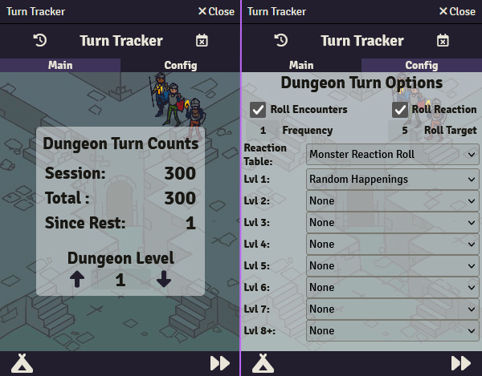
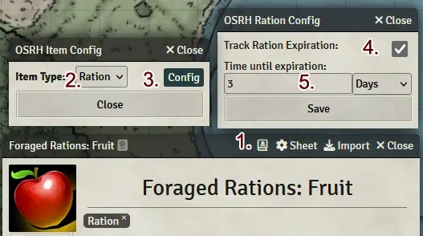
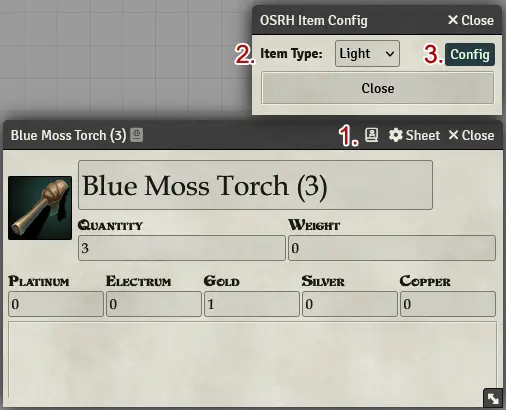
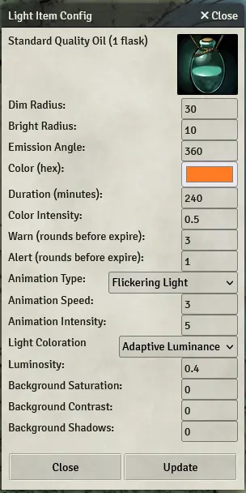
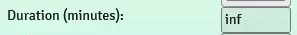
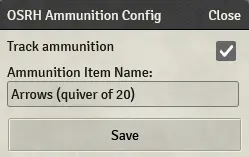
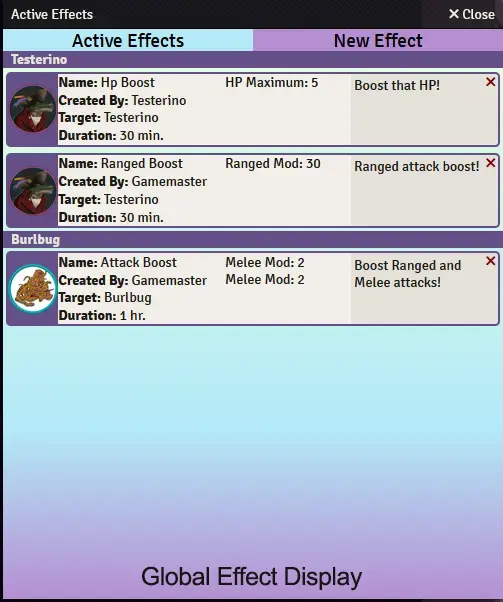
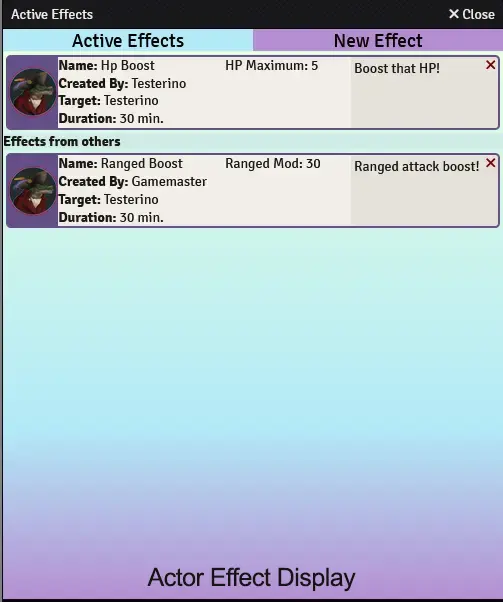
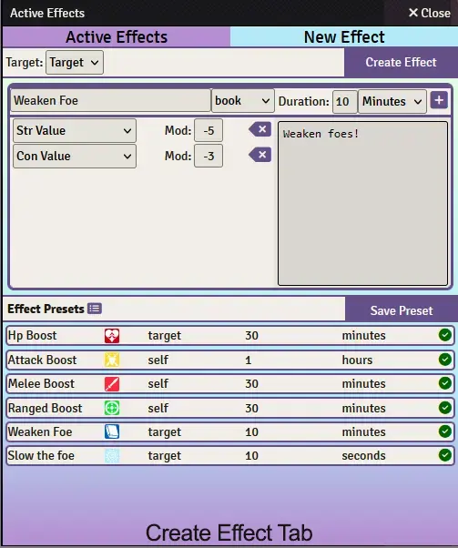

# OSR-helper module

Created by RabidOwlbear.

Supprted via patreon: https://patreon.com/RabidOwlbear

An unimaginatively named module that aims to assist with light, time, and resource management. For use in games using the Foundry Vtt implementation of the 'Old School Essentials' system.
This module provides several macros found in a compendium named "OSR-helper Macros".

### installation

install using the following manifest url:

https://raw.githubusercontent.com/RabidOwlbear/osr-helper/master/module.json

### usage

Upon initial load a journal entry will be created using the default name of "Turn Count". This journal will be populated with several statistics reflecting number of turns elapsed this session, since that last rest was taken, and the total number of turns so far in the game. Using the provided "OSE-helper Dungeon Turn (base)" macro the Referee can advance the game time in standard 10 minute turn intervals. The "Turn Count" journal will be updated to reflect the current counts.

The provided "OSR-helper reset session count" will reset the session count to zero.
The provided "OSR-helper reset all counts" macro will reset all counts.
The provided "OSR-helper Rest" macro will reset the turns since last rest count to zero.

---

### Turn Tracker

On the main tab of the tracker the current dungeon turn counts  and dungeon level is desplayed. 
The dungeon level may be increased by pressing one of the arrow buttons on either side. 
The party may rest my using the rest button located in the bottom left corner of the application. 
The dungeon turn may be advanced by clicking the button in the bottom right corner.
The session turn count may be reset using the button in the upper left corner of the application.
The total turn count may be reset by clicking the button in the top right corner. This will open a dialog warning that this change cannot be undone. Click the reset button to reset or close to return to the tracker.

On the config tab (only visible to GM users) The GM may alter the dungeon turn settings. This replaces the dungeon turn settings in the game options. 
- Checking the roll encounters box will roll for encounters based on the frequency determined in the field below.
- The frequency (in turns) determines how often an encounter roll will be performed.
- Checking the Roll for reaction checkbox will roll on the determined reaction table whenever an encounter roll is rolled.
- The roll target input determines the success chance for an encounter roll. The encounter roll is a 1d6 roll under roll.
- The reaction table inout is used to select a table for reaction rolls. The select will list the name of all tables in the game world.
- The Lvl inputs are used to set the encounter table per dungeon level. When an encounter is rolled it will use the current dungeon level to find the correct encounter table. If the dungeon level is 9 or greater the level 8 encounter table will be used.

When the advance dungeon turn button is used, the Turn Tracker will advance the game time by 10 minutes and update the turn counts by one. It will then check the rest count. At 3 turns since last rest a chat message will be created warning the players that they need to rest, at +5 turns the warning becomes red. If the players progress beyond 1 hour without rest, the chat message will then include the relevant penalties, repeating this added text every 5 subsequent turns.

The Tracker will roll any encounter and reaction tables as defined in the config tab.

---
### Configurable Items
##### Item Configuration Menu

1. Item Configuation Menu Button.
2. Item Type: sets the OSR Helper item type.
3. Item Configuation: Opens the relevant configuration menu for the item.

 Certain item types may be configured using the item config button added to the title bar of relevant items. This menu may be used to set the item type, and open the relevant configuration panel for the item. 

 #### Ration Items

 4. Track Ration Expiration: When checked, the item will have its duration checked when party ration expiration tracking is enabled.
 5. Ration Duration: Length of time before the ration item expires.

 Ration Items may be tracked, and set to expire after a certain amount of in game time. Selecting the ration item type will enable this items use with the eat ration and ration item repoting features of the module.

 Ration Expiration tracking may be enabled for the adventuring party as tracked with the turn tracker. To enable party ration tracking, navigate to the global config tab of the turn tracker, and check the Track Party ration Expiration setting and save the settings.
 When enabled, each turn the tracker will check for tracked ration items, if any are found their duration will be decremented by the turn time amount, if the Remaining duration is 0 the item name will be appended with '- expired'.

 When the track party ration expiration setting is enabled, the remaining ration duration will be displayed in any ration report generated.
 

#### Custom Lights

1. Item Config Button: Click this item to open the OSRH item Config window.
2. Item type Select: Select the Item type here. May be set to Light, Ration and None. This setting eables light or ration tracking ofr this item.
3. Light Item Configuration: This button only appears when light is selected as the item type. Clicking it will open the light item configuration for this item.

Each time game world time advances, all lit light sources will be checked against their duration, if the duration is exceeded the tight source will be extinguished, and the total quantity for that item will be decremented by 1. If the item quantity is reduced to zero the item will be deleted from the actor's invetory.

Custom light sources can be created by checking the **Enable Light Item Settings Config.** setting in the ose helper module settings. This setting will add a book icon to applicable Item types.

The wrench icon (number 1. in image below) will also be added to the header of the item details window, allowing for lights to be configured from the item sidebar tab, or inside compendiums. 

**Light Configuration Panel** - Here you can define the custom light properties and duration.
**Close** - Closes the configuration panel without saving.
**Update** - Updates the light configuration data.

Light durations should be a positive number, or "inf" for infinite light duration. (see above)

To activate a light, a player needs access to the provided "Light Toggle " macro. 

To use, a player token must be selected.

When clicked:
- if a light is already lit on the selected token, the light will be extinguished.
- if no light is currently lit, a dialog will be created containing a dropdown populated with the names and quantities of all items in the selected token actors inventory that contain a "Light" tag.
- once a light source is selected, clicking "Light On" with change the selected token's light settings to match tose contained in the selected light source's configuration settings.

note: Several light items have been provided in the OSR-helper Items compendium.
If the macro has been used to light a light source, the light can be extinguished by clicking the macro again, preserving any remaning duration until lit again by clicking the Light On macro and selecting the corresponding light type.

---
### Ammunition Tracking

The attack function located in the ui controls above the macro bar allows for limited ammunition tracking.

Weapon items may have an ammunition item assigned using the Ammunition config form (above), accessible via a button on the OSRH Item Config Form.

Checking the Track Ammunition checkbox will enable ammunition tracking for that item. When checked the attack function will look for an item with the same name as defined in the Ammunition Item Name field of the ammunition config form.

When tracked the Attack function will reduce the quantity of the ammunition item by 1, deleting the item when the quantity reaches 0

---

### Ration Report

The OSR-helper Ration Report macro

When clicked this macro will generate a report detailing all rations currently held by all tracked Player and Retainer actors seprated by name, listing items held and their quantities, color coded.
Total number of days worth of rations for the entire tracked group(assuming the party pools resources) is also profided in a color coded display.

When ration expiration is tracked the ration report will include time until expiration for all ration items.
---

### Custom Effects

A 'active effect' system has been implementd and can be accessed via an  icon located on the character portrait secton of the character sheet when moused over. Accessing the effects application via this button will open the app window displaying all effects applied to and by the selected actor.

For GM users, an icon has been aded to the OSR helper ui controls that will open the global effects application which displays all current actively tracked effects.

#### Active Effects List

 

- The first column of each displayed effect displays general information about the effect.
- The second column lists the targeted attributes and the modication value.
- The third column displays the effects description.
- Effect list, description and saved preset lists become scrollable on overflow.

Global Effect Display:
- Effects are grouped by the actor they are applied to.
- A header above each group of effects displays the name of the Actor the effectsa are targeting.
- Clicking the red x in the right upper corner of the listed effect will delete that effect.

Actor Effect Display
- Effects are grouped by effects created by the actor, and effects applied to the actor by others.
- The red x  in the right upper corner of the listed actor created effects will delete that effect.

#### New Active Effect

 

Mousing over any input will display its function.

- Target: a dropdown for selecting target type. Self applies the effect to the actor used to opem the effect app. Target applies the effect to the actors associated with the tokens currently targeted.
- Name: Name for active effect.
- Icon: Icon to apply to the token of the targeted actor.
- Duration: Select an interval from the dropdown menu, and enter a number.
- Add Effect: Clicking the button to the right of the effect duration will add an attribute to the effect list. This row will include a select for choosing the attribute to target, and a mod inout to enter the modification value. Clicking the x buton on the right side of an effect list row will delete that entry from the list. An effect requires at least one added effect.
- Create Effect: located in the middle left. Clicking this button will attempt to create the created effect on the selected target.
- Save Preset: Located to the right of the effect presets header. Clicking this button will attempt to save the defined effect as a preset.
- Preset list: Saved effect presets will be displayed below the effect presets header.
- Apply Preset Button: Clicking the green checkmark button on the right side of a displayed saved effect will apply the saved preset data to the create effect fields. 
- Clicking an effect preset name will expand the entry displaying the targeted attributesd and effect description.
- Manage Presets button: This button appears to the immediate right of the effect presets header. This button is only visible for GM level users. Clicking this button will change the green checkmark button on the saved effects to red minus buttons. clicking a red button willd delete that saved preset. 

Each time the game world time updates all active effect's duration will be checked, and any expired effects will be removed.

---

#### Effect Form Themes

Color themes have been added for the active effect forms. The theme can be changed in the module settings.

---

## Travel Calculator

This macro opens a window displaying the active party members and their individual travel rates, and a base rate determined by the slowest party member.
Selecting a terrain type will update the displayed travel rates.
The Navigation Check button will roll a d6 and apply the terrain modifier and any bonus from the bonus field and output the results to a chat message.
The Forage check will roll a d6 plus any modifier in the bonus field and output the results to a chat message.

## Character vs Monster reaction roll.

This macro opens a dialog listing all characters in the party sheet, and their charisma modifier. Selecting an actor and clicking the roll button will roll for reaction adding the characters charisma modifier to the roll. Useful for social encounters.
To use, edit the macro variable tableName with the name of the monster reaction roll table you wish to use.

## Random Name

This macro opens a dialog containing name type options. After selecting both options, and clicking the pick button, a random name will be generated and sent to chat via message.
If a single token is selected when the macro is run, the random name will be applied to the token and associated actor sheet.
If whisper is checked, the created chat message will be whispered to the user that initiated the macro.

## Currency Converter

The module adds a currency converter icon(stack of coins) to the character sheet inventory tab treasure header. CLicing the icon will open a diallog that will allow for converting once currency type to another. 
to use:
- click the Currenc Converter icon
- enter an amount into the amount field
- select initial currency from the dropdown to the right of the amount
- select a currency to convert to from the rightmost dropdown
- click convert
If the actor does not posses a currency item for the type of currency being converted to or from, one will be created in the actors inventory.

## Equipable containers

To enable this feature, check the box  on the corresponding module setting. This will add a button to container items in character inventories that when clicked will equip or unequp the container. when unequipped all items contained in the container will have their weight properties set to zero. When the container is re-equipped the contained items will have their weight restored to the original value. This feature is experimental.
